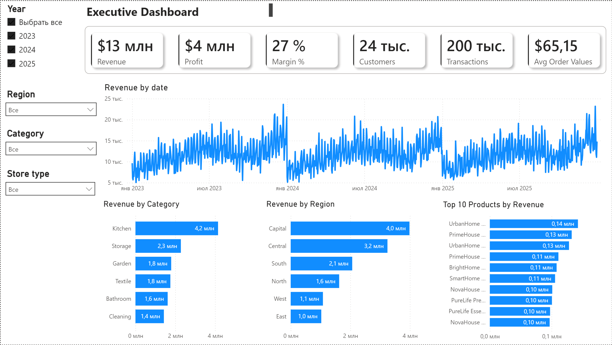
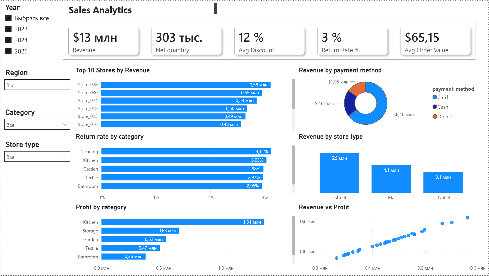
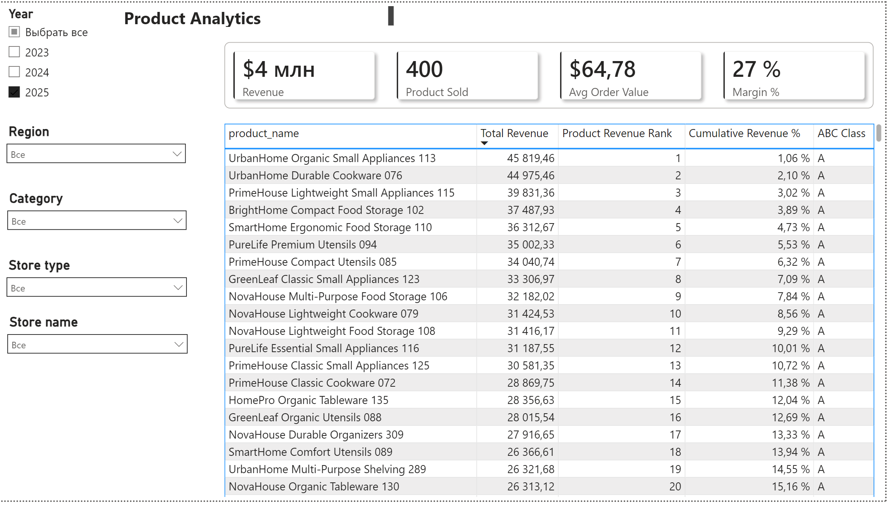
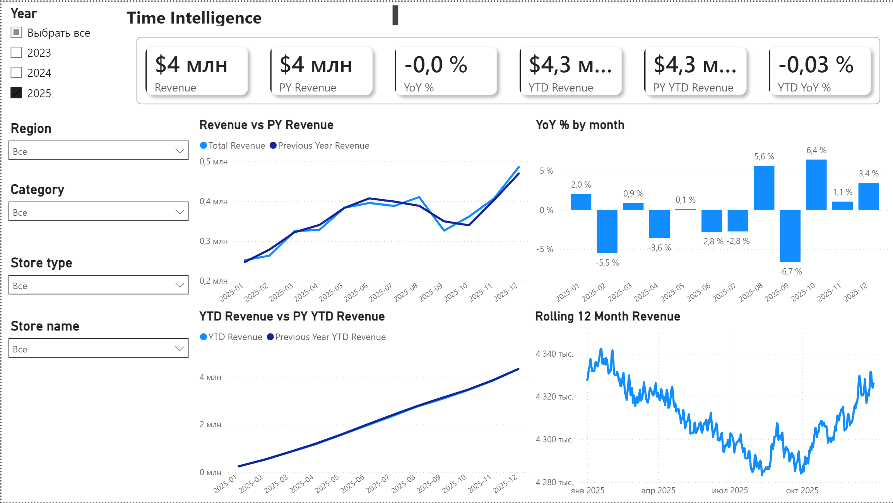

# Retail Analytics Dashboard

## Описание проекта

Retail Analytics Dashboard — аналитический BI-проект полного цикла, демонстрирующий процесс работы с данными от их генерации и хранения до построения аналитической отчетности и визуализации в Power BI.

Проект построен на синтетическом наборе данных розничной сети магазинов товаров для дома. Данные были сгенерированы с помощью Python, загружены в PostgreSQL и использованы для построения интерактивного дашборда в Power BI.

Основная цель проекта — предоставить руководству компании удобный инструмент для анализа продаж, прибыльности, эффективности магазинов, ассортимента товаров и динамики бизнеса во времени.

---

# Бизнес-задача

Розничные компании ежедневно формируют большой объем данных о продажах, клиентах и товарах. Руководству необходим инструмент, позволяющий быстро оценивать текущее состояние бизнеса, выявлять точки роста и своевременно реагировать на негативные тенденции.

Данный дашборд позволяет отвечать на следующие бизнес-вопросы:

* Как изменяются продажи и прибыль компании?
* Какие товары формируют основную часть выручки?
* Какие магазины работают наиболее эффективно?
* Как меняются показатели относительно прошлого года?
* Выполняется ли рост бизнеса относительно предыдущих периодов?
* Какие долгосрочные тренды наблюдаются в продажах?

Использование дашборда позволяет принимать решения на основе данных и оперативно контролировать ключевые показатели деятельности компании.

---

# Используемый стек технологий

## Генерация и обработка данных

* Python
* Pandas

## Хранение данных

* PostgreSQL

## Бизнес-аналитика

* Power BI
* DAX
* Power Query

## Контроль версий

* Git
* GitHub

---

# Архитектура проекта

Python (генерация данных)
↓
CSV-файлы
↓
PostgreSQL
↓
Power BI
↓
Интерактивный дашборд

---

# Модель данных

Проект реализован по схеме Star Schema.

## Таблица фактов

* FactSales

## Таблицы измерений

* DimDate
* DimProducts
* DimStores
* DimEmployees
* DimCustomers

Использование звездной схемы обеспечивает высокую производительность расчетов и упрощает построение аналитических моделей в Power BI.

---

# Характеристики набора данных

| Таблица      | Количество записей |
| ------------ | -----------------: |
| FactSales    |            200 000 |
| DimCustomers |             30 000 |
| DimProducts  |                400 |
| DimStores    |                 30 |
| DimEmployees |           ~350–450 |
| DimDate      |              1 096 |

Набор данных охватывает период с 2023 по 2025 год и содержит информацию о продажах, возвратах, товарах, клиентах, сотрудниках и магазинах.

Перед загрузкой в PostgreSQL был проведен контроль качества данных, включая проверку первичных ключей, внешних ключей, отсутствия пропусков и корректности бизнес-логики.

---

# Структура дашборда

## 1. Executive Dashboard

### Цель

Предоставить руководству краткий обзор ключевых показателей бизнеса.

### Основные показатели

* Revenue
* Profit
* Transactions
* Average Order Value

### Визуализации

* Динамика выручки
* Выручка по категориям товаров
* Выручка по регионам
* Топ товаров по выручке

### Бизнес-ценность

Позволяет быстро оценить текущее состояние бизнеса и выявить основные источники дохода.

---

## 2. Sales Analytics

### Цель

Провести детальный анализ продаж.

### Основные показатели

* Revenue
* Net Quantity Sold
* Average Discount
* Return Rate
* Average Order Value

### Визуализации

* Выручка по магазинам
* Выручка по способам оплаты
* Сравнение Revenue и Profit
* Доля возвратов по категориям
* Выручка по типам магазинов

### Бизнес-ценность

Позволяет выявлять различия в эффективности магазинов и анализировать влияние скидок и возвратов на продажи.

---

## 3. Product ABC Analysis

### Цель

Определить товары, формирующие основную часть выручки компании.

### Реализованные расчеты DAX

* Product Revenue Rank
* Cumulative Revenue %
* Dynamic ABC Classification

### Правила классификации

* Класс A — первые 80% накопленной выручки
* Класс B — следующие 15%
* Класс C — оставшиеся 5%

### Бизнес-ценность

Позволяет определить наиболее важные товары для управления ассортиментом и запасами.

---

## 4. Time Intelligence

### Цель

Провести анализ динамики бизнеса во времени и сравнение показателей с предыдущими периодами.

### Реализованные расчеты DAX

* Previous Year Revenue
* YoY %
* YTD Revenue
* Previous Year YTD Revenue
* YTD YoY %
* Rolling 12 Months Revenue
* MTD Revenue
* QTD Revenue

### Визуализации

* Revenue vs Previous Year Revenue
* YoY % по месяцам
* YTD Revenue vs Previous Year YTD Revenue
* Rolling 12 Months Revenue

### Бизнес-ценность

Позволяет анализировать рост бизнеса, сезонность продаж и долгосрочные тренды.

---

# Dashboard Preview

## Executive Dashboard



## Sales Analytics



## Product ABC Analysis



## Time Intelligence



# Использование DAX

В проекте реализованы сложные аналитические расчеты с использованием языка DAX.

## ABC-анализ

Динамическая классификация товаров на основе накопленной доли выручки.

## Time Intelligence

Реализованы следующие сценарии анализа:

* Сравнение с предыдущим годом (Previous Year)
* Year-over-Year (YoY)
* Year-to-Date (YTD)
* Month-to-Date (MTD)
* Quarter-to-Date (QTD)
* Rolling 12 Months

Данные расчеты позволяют проводить полноценный анализ временных рядов и динамики бизнеса.

---

# Результаты проекта

В рамках проекта были реализованы:

* Генерация синтетического набора данных в Python
* Проверка качества данных
* Загрузка данных в PostgreSQL
* Построение модели данных по схеме Star Schema
* Создание интерактивного Power BI дашборда
* Реализация ABC-анализа
* Реализация Time Intelligence расчетов
* Разработка четырех аналитических страниц

Проект демонстрирует полный цикл работы аналитика данных: от подготовки данных до построения бизнес-отчетности.

---

# Структура репозитория

```text
data/
├── raw/
├── processed/

docs/
├── Словарь данных
├── Отчет о качестве данных
├── Описание проекта

sql/
├── ddl.sql

src/
├── Скрипты генерации данных

powerbi/
├── Retail Dashboard.pbix

logs/

notebooks/
```

---

# Автор

Абдикулов Нурхан Омарович

Итоговый проект по модулю Power BI

Python • PostgreSQL • Power BI

# Retail Analytics Dashboard

## Project Overview

Retail Analytics Dashboard is an end-to-end Business Intelligence project that demonstrates the complete analytics workflow from data generation and storage to business reporting and visualization.

The project is based on a synthetic retail dataset representing a chain of home and household goods stores. Data was generated using Python, stored in PostgreSQL, and analyzed in Power BI.

The main objective of the project is to provide management with a comprehensive view of sales performance, profitability, product contribution, and business trends over time.

---

# Business Problem

Retail companies generate large volumes of transactional data every day. Decision-makers need an efficient way to monitor business performance, identify growth opportunities, and detect potential issues.

This dashboard was designed to answer key business questions:

* How are sales and profits changing over time?
* Which products generate the majority of revenue?
* Which stores perform better than others?
* What are the current revenue trends compared to previous periods?
* How does the business perform compared to the previous year?
* What long-term trends can be observed in sales performance?

The dashboard enables management to monitor performance, evaluate trends, and make data-driven decisions.

---

# Technology Stack

## Data Generation & Processing

* Python
* Pandas


## Data Storage

* PostgreSQL

## Business Intelligence

* Power BI
* DAX
* Power Query

## Version Control

* Git
* GitHub

---

# Project Architecture

Python Data Generation
↓
CSV Files
↓
PostgreSQL
↓
Power BI
↓
Interactive Dashboard

---

# Data Model

The project follows a Star Schema design.

## Fact Table

* FactSales

## Dimension Tables

* DimDate
* DimProducts
* DimStores
* DimEmployees
* DimCustomers

The dimensional model enables efficient analytical calculations and implementation of advanced DAX measures.

---

# Dataset Overview

| Table        |    Rows |
| ------------ | ------: |
| FactSales    | 200,000 |
| DimCustomers |  30,000 |
| DimProducts  |     400 |
| DimStores    |      30 |
| DimEmployees |~350–450 |
| DimDate      |   1,096 |

The dataset covers the period from 2023 to 2025 and includes sales, returns, discounts, customers, products, stores, and employee information. Data quality validation was performed before loading into PostgreSQL. The dataset passed all integrity and business-rule checks.

---

# Dashboard Pages

## 1. Executive Dashboard

Purpose:

Provide a high-level overview of business performance.

Main KPIs:

* Revenue
* Profit
* Transactions
* Average Order Value

Visualizations:

* Revenue Trend
* Revenue by Category
* Revenue by Region
* Top Products by Revenue

Business Value:

Allows management to quickly assess overall business performance and identify major revenue drivers.

---

## 2. Sales Analytics

Purpose:

Analyze sales performance across stores, payment methods, and product categories.

Main Metrics:

* Revenue
* Net Quantity Sold
* Average Discount
* Return Rate
* Average Order Value

Visualizations:

* Revenue by Store
* Revenue by Payment Method
* Revenue vs Profit
* Return Rate by Category
* Revenue by Store Type

Business Value:

Helps identify operational performance differences between stores and sales channels.

---

## 3. Product ABC Analysis

Purpose:

Identify products that contribute most significantly to total revenue.

Implemented DAX Logic:

* Product Revenue Rank
* Cumulative Revenue %
* Dynamic ABC Classification

Classification Rules:

* A Class → First 80% of cumulative revenue
* B Class → Next 15%
* C Class → Remaining 5%

Business Value:

Supports assortment optimization and inventory prioritization.

---

## 4. Time Intelligence

Purpose:

Analyze business performance over time and compare current results with previous periods.

Implemented DAX Measures:

* Previous Year Revenue
* YoY %
* YTD Revenue
* Previous Year YTD Revenue
* YTD YoY %
* Rolling 12 Months Revenue
* MTD Revenue
* QTD Revenue

Visualizations:

* Revenue vs Previous Year Revenue
* YoY % by Month
* YTD Revenue vs Previous Year YTD Revenue
* Rolling 12 Months Revenue

Business Value:

Provides insight into growth trends, seasonality, and long-term business performance.

---

# Advanced DAX Calculations

The project includes several advanced DAX implementations:

### ABC Analysis

Dynamic product classification based on cumulative revenue contribution.

### Time Intelligence

* Year-over-Year comparison
* Year-to-Date calculations
* Previous Year calculations
* Rolling 12 Months analysis
* Month-to-Date calculations
* Quarter-to-Date calculations

These measures demonstrate the ability to implement business-oriented analytical logic in Power BI.

---

# Key Project Outcomes

* Built a Star Schema analytical model
* Generated and validated a synthetic retail dataset
* Loaded data into PostgreSQL
* Developed an interactive Power BI dashboard
* Implemented advanced DAX calculations
* Created business-focused analytical reports
* Demonstrated end-to-end Data Analytics workflow

---

# Repository Structure

```text
data/
├── raw/
├── processed/

docs/
├── Data Dictionary
├── Data Quality Report
├── Project Overview

sql/
├── ddl.sql

src/
├── Data Generation Scripts

powerbi/
├── Retail Dashboard.pbix

logs/

notebooks/
```

---

# Author

Nurkhan Abdikulov

Data Analytics Portfolio Project
Python • PostgreSQL • Power BI

